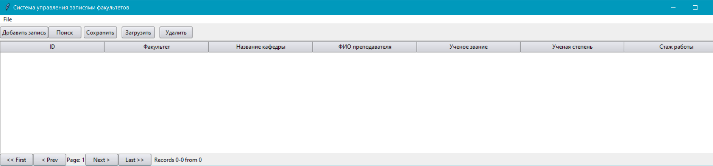

# Лабораторная работа №2. Вариант 12
### Описание программы
---
Программа предназначена для управления данными о преподавателях университета с помощью графического интерфейса и XML файлов. Реализован функционал поиска и удаления по по фамилии преподавателя(может быть заполнен только один элемент ФИО, например имя);, по наименованию кафедры; 
по ученому званию и факультету;
по стажу работы (задается верхний и нижний предел);


### Демонстрация работы программы
`Главное окно` программы представлено в виде таблицы со столбиками Id, Факультет, Наименование кафедры, ФИО преподавателя, Ученое звание, Ученая степень, Стаж работы. Также на главном окне присутствуют различные кнопки управления (переключение самих страниц) и инструменты для работы с базой (загрузка из файла, сохранение в файл, добавление записи, поиск по фильтру и удаление по фильтру).



 ### Работа с данными
 Программа поддерживает работу с видом файла - `.xml`. При загрузке файла программа предлагает, что делать с записями из файла: дообавить их в таблицу или заменить новыми записями старые.
 
 

 После загрузки программа выводит сообщение об успешной или не успешной загрузке файла.

 

 Также можно загрузить записи в файл `.xml`. После сохранения программа оповестит об успешном/не успешном сохранении. 
 
 
 

### Добавление информации о преподавателе
Для добавления преподавателя необходимо нажать `Добавить запись`. Открывается окно, в котором пользователь может ввести данные о преподавателе.


Поля Факультет, Наименование кафедры, Ученое звание, Ученая степень можно выбрать из выдвигающегося списка. Также предусмотрен функционал, который после выбора факультета предлагать кафедры 
только для выбранного факультета.


В данной процедуре добавления обработаны такие ошибки, как:
```
- стаж работы может содержать только цифры
- поля Факультет, Наименование кафедры, ФИО преподавателя, Ученое звание, Ученая степень должны содержать только буквы русского алфавита
- нельзя оставлять пустые поля
```
Пример некорректного ввода:


## Поиск преподавателя
В данной программе реализована логика поиска преподавателя. Результаты поиска преподавателй отображаются в новой таблице, где указывается, сколько преподавателей было найдено или не найдено ни одного. 


### Удаление питомца
В данной программе реализована логика удаления преподавателя. Удалять мы можем по заявленным критериям. Критерии могут быть выбраны поодиночке - пользователь сам выбирает необходимый критерий удаления преподавателя. При успешном удалении выводится окно успеха с количеством удаленных записей. При неуспешном сообщается о несуществовании такой записи в таблице. Пустые поля оставлять нельзя. После успешного либо неуспешного удаления поля ввода критерия обнуляются.


